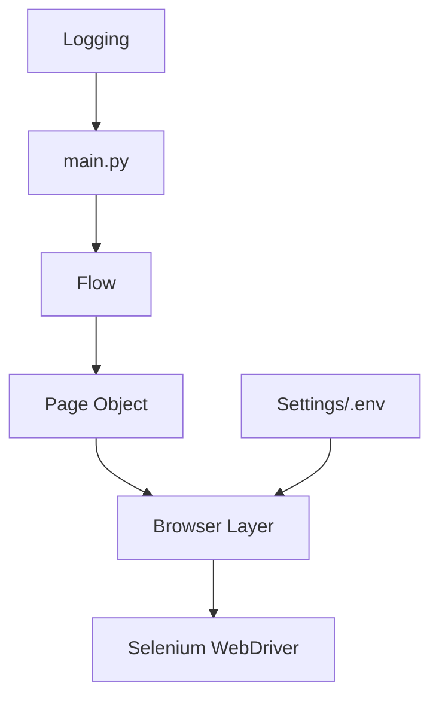

# Desafio SIEG - Base de Automação com Selenium

Projeto base para automação de navegador com **Python + Selenium**, desenhado para ser modular, testável e extensível.

## Visão geral

Esta primeira etapa entrega a fundação de um projeto profissional de automação, priorizando:
- separação de responsabilidades;
- manutenção simples;
- preparação para múltiplos fluxos e páginas;
- execução local e em CI.

A automação real do domínio de negócio será adicionada em próximas etapas.

## Arquitetura



Princípio principal: **Flow orquestra**, **Page Object interage com página**, **Browser centraliza WebDriver**.

## Pré-requisitos

- Python 3.11+
- Git
- Google Chrome instalado (ou outro navegador suportado futuramente)
- pip

> Selenium 4 usa **Selenium Manager** por padrão para resolver o driver automaticamente, evitando acoplamento com binários locais.

## Instalação

### Linux/macOS

```bash
git clone https://github.com/MatheusMenezesss/Desafio_SIEG.git
cd Desafio_SIEG
python -m venv .venv
source .venv/bin/activate
pip install -r requirements.txt
```

### Windows (PowerShell)

```powershell
git clone https://github.com/MatheusMenezesss/Desafio_SIEG.git
cd Desafio_SIEG
python -m venv .venv
.venv\Scripts\Activate.ps1
pip install -r requirements.txt
```

## Configuração

```bash
cp .env.example .env
```

Veja detalhes de variáveis em `docs/configuration.md`.

## Execução

```bash
python -m automation.main
```

## Testes

Executar suíte padrão (unit + integration):

```bash
pytest
```

Executar apenas unitários:

```bash
pytest tests/unit
```

Executar E2E (navegador real):

```bash
pytest -m e2e --run-e2e
```

## Estrutura do projeto

- `src/automation/config`: leitura e tipagem de configurações.
- `src/automation/browser`: criação/configuração do WebDriver, options e waits.
- `src/automation/pages`: Page Objects (POM).
- `src/automation/flows`: casos de uso de alto nível.
- `src/automation/services`: integrações e serviços de suporte.
- `src/automation/utils`: logging e utilitários transversais.
- `src/automation/exceptions`: exceções customizadas da aplicação.
- `tests/unit`: testes isolados de componentes.
- `tests/integration`: testes de integração entre camadas.
- `tests/e2e`: testes com browser real.
- `docs`: documentação técnica detalhada.

## Segurança

- `.env` não versionado.
- Nenhuma credencial hardcoded.
- `.env.example` contém apenas placeholders.
- Logs e relatórios ficam fora do versionamento de conteúdo (`.gitkeep` preservado).

## Troubleshooting

Consulte `docs/troubleshooting.md` para:
- incompatibilidade navegador/driver;
- timeout e elemento não encontrado;
- problemas com variáveis de ambiente;
- erros de permissão.
